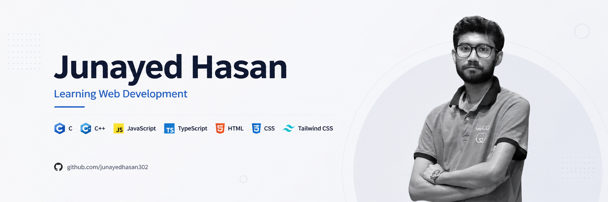

<!-- ======================= BANNER ======================= -->

  

 

<!-- ======================= INTRO ======================= -->

<h1 align="center">Hi 👋, I'm Junayed Hasan</h1>

<h3 align="center">
  💻 Learning Web Development | CSE Student
</h3>

  I'm currently learning and building my way into Web Development,
  one project at a time.

---

<!-- ======================= ABOUT ME ======================= -->

## 👨‍💻 About Me

I'm a Computer Science student with a growing interest in
Web Development and modern web technologies.

I enjoy learning by building real-world projects, experimenting
with new technologies, and improving my programming and
problem-solving skills.

Currently, I'm focused on strengthening my fundamentals and
building a solid foundation for my journey as a Web Developer.

📍 Dhaka, Bangladesh  
📧 junayedhasan302@gmail.com

---

<!-- ======================= CURRENTLY ======================= -->

## 🔭 Currently

- 🌱 Learning **Web Development**
- ⚡ Exploring **JavaScript & TypeScript**
- 🎨 Building responsive websites with **HTML, CSS & Tailwind CSS**
- 💻 Strengthening my programming skills with **C & C++**
- 🚀 Exploring modern web technologies
- 📚 Improving my problem-solving skills through practice
- 🛠️ Building projects to gain practical experience

---

<!-- ======================= TECH STACK ======================= -->

## 🛠️ Tech Stack

### 💻 Programming Languages

  

### 🌐 Web Development

  

### 🗄️ Database

  

### 🧰 Tools

  

---

<!-- ======================= PROJECTS ======================= -->

## 🚀 Featured Projects

### 🌐 Assignment 01 — Frontend Project

A responsive frontend website built as part of my
Web Development learning journey.

**Tech Stack:** HTML • CSS • Tailwind CSS

🔗 **Live Demo:**  
https://junayedhasan302.github.io/assignment-01/

💻 **Source Code:**  
https://github.com/junayedhasan302/assignment-01

---

<!-- ======================= CONNECT ======================= -->

## 🌐 Connect With Me

---

<!-- ======================= GITHUB STATS ======================= -->

## 📊 GitHub Stats

---

<!-- ======================= STREAK ======================= -->

## 🔥 GitHub Streak

  

---

<!-- ======================= PROFILE VIEWS ======================= -->

  

---

<!-- ======================= FOOTER ======================= -->

  <i>“Learning. Building. Improving. 🚀”</i>

